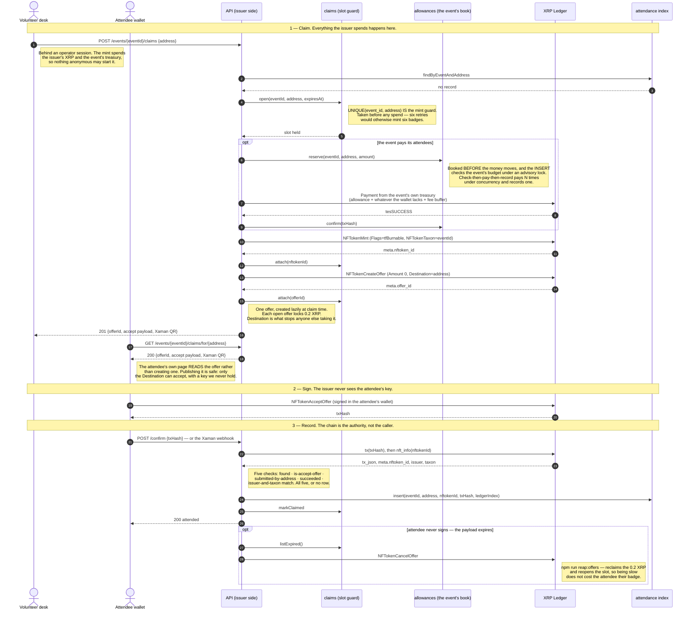
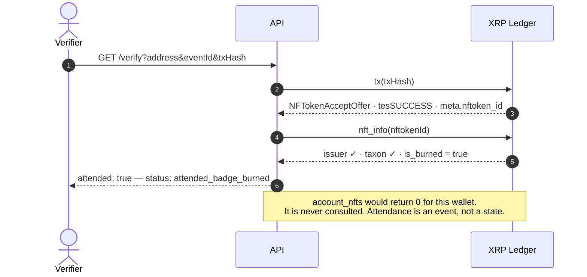

# XRPL NFT Layer

Mint, claim, and verify POAP-style attendance badges on the XRP Ledger.

Started as the NFT layer only; now a working product around it — events,
registration, an attendee pass, a volunteer desk, an organiser console, and an
event store where attendees spend an allowance their event's treasury paid them.

Ledger behaviour here was measured rather than assumed: see
[`docs/ground-truth.md`](docs/ground-truth.md).

## There is nothing to deploy

XRPL NFTs are native protocol transaction types, not user-deployed code. There
is no Solidity, no contract address, no ABI, no gas. `NFTokenMint` is a
transaction type in the same way `Payment` is.

Going to mainnet is two changes on the ledger side: point `XRPL_ENDPOINT` at a
mainnet node, and use an account funded with real XRP. The transaction code is
identical.

The server around those transactions is an ordinary web app and does have to go
somewhere — `deploy/provision-ubuntu.sh` sets a fresh Ubuntu box up behind nginx
and TLS, and `npm run check:cutover` walks what is left.

## Quick start

```bash
npm install
cp .env.example .env
npm run typecheck && npm test     # 917 tests, no network
npm run e2e:testnet               # live testnet, faucet-funded
```

`e2e:testnet` funds two throwaway wallets from the faucet and runs a full
mint → offer → accept → verify cycle. Nothing else should be attempted until
that comes back green.

| Command | What it does |
|---|---|
| `npm test` | 917 unit tests against a fake gateway. Never touches the network. |
| `npm run typecheck` | `tsc --noEmit` over `src`, `scripts`, `test` |
| `npm run build` | Emits `dist/` from `src` only, via `tsconfig.build.json`, then copies the pages |
| `npm run dev` | The API and its pages against your `.env`, reloading on change |
| `npm run e2e:testnet` | Brief §8 step 1 — the full cycle, 33 assertions |
| `npm run e2e:burn` | Brief §8 step 2 — burn a claimed badge, prove it still verifies |
| `npm run keygen` | Offline issuer keygen. Seed goes to a 0600 file, never stdout |
| `npm run admin:hash` | Turns a password into the scrypt hash `ADMIN_PASSWORD_HASH` wants |
| `npm run migrate` | Applies `src/db/migrations/*.sql`, idempotent |
| `npm run demo` | The whole app on testnet, plus the `/demo` role-play. Faucet-funds its own issuer |
| `npm run check:cutover` | Mechanises the §9 cutover checklist |
| `npm run reap:offers` | Cancels offers on abandoned claims, reclaiming 0.2 XRP each. Dry run by default |
| `npm run e2e:mainnet` | Spends real XRP. Refuses without an explicit consent flag |

## The pages

The product is seven self-contained HTML files in `src/api/public/`, where the
demo's three sit alongside them. They are served off disk per request by
`src/api/routes/pages.ts` — no build step, so an edit shows up on reload.

| Page | Who | What happens |
|---|---|---|
| `/` and `/events` | anyone | Every event that has happened, with its turnout, and a Register button on the ones still open |
| `/events/:eventId` | anyone | One event: its particulars, its turnout, and every badge it minted |
| `/register` | attendee | The invitation. Prove a wallet in Xaman, put a name to it |
| `/attend` | attendee, on a phone | Their pass: the code the desk scans, the badge once it lands, the event's store, and the code a vendor scans to hand an order over |
| `/volunteer` | volunteer, on a laptop | The desk: scan, see whether the wallet can hold a badge, pay the allowance, issue the badge |
| `/vendor` | vendor, at a counter | Paid orders still to hand over |
| `/admin` | organiser | Events, registrations, vendors and prices, and each event's treasury |

`/attend` holds no key. Everything needing a signature happens inside Xaman on
the attendee's own phone, which is also why registration needs `XUMM_API_KEY`
and `XUMM_API_SECRET`: an address somebody typed is a claim, a sign-in is a
proof, and a badge minted to the wrong wallet cannot be recovered because it is
soulbound. `/vendor` is the same idea from the other side — the wallet a vendor
is paid into is their login.

`/volunteer` and `/admin` need an operator: `ADMIN_EMAIL`,
`ADMIN_PASSWORD_HASH` (`npm run admin:hash`) and `SESSION_SECRET`. With none of
them set, everything under `/admin/api` answers 503 rather than being served
open, and the desk cannot issue.

## Try it — the demo

```bash
npm run demo            # localhost
npm run demo -- --lan   # also on your network, so a real phone can join
```

One command, no setup: it faucet-funds a throwaway testnet issuer, stands the
whole API up in front of it, and prints the URLs — the pages above first, then
the `/demo/*` role-play. Storage is in memory unless `DATABASE_URL` is set, in
which case it uses Postgres and remembers the issuer between runs: events and
registrations outlive the process, and a fresh issuer each restart would orphan
every badge the last one minted.

**Two screens, one event** — the demo is a role-play of a real badge desk:

| Page | Who | What happens |
|---|---|---|
| `/demo/attendee` | attendee, on a phone | Get a wallet, show it as a **QR code**, then confirm the badge that appears |
| `/demo/volunteer` | volunteer, on a laptop | **Scan** the QR, see whether the wallet can even receive an NFT, **fund it** if not, then issue the badge |
| `/demo/walkthrough` | one screen | The original explainer: the whole cycle in seven steps, ending in a burn |
| `/demo` | — | Role chooser |

The volunteer page is not a demo page at all — it is the same file served at
`/volunteer`, so it needs the admin credentials above. Without them it can look
but not issue, because the mint is behind an operator session wherever it is
called from.

The interesting default is an **unactivated** attendee wallet: it has no account
root, so a badge cannot be delivered to it at all. The volunteer's console says
so, shows the shortfall, and offers to pay — which is the allowance path, with
its book written before the money moves and its per-event budget, made visible.

Scanning on these two pages uses the browser's built-in `BarcodeDetector`
(Chrome/Edge). Where
that is missing or there is no camera, typing the address is a first-class
path, not a fallback bolted on. The QR encoder is hand-written and in-file —
no library, no CDN.

Both pages drive the real endpoints, not a parallel demo path. Every step shows
the method, the path, the raw JSON and an explorer link, and a request log
lists every call made — so you can check it is not faking anything.

`DEMO_ENABLED` is **testnet-only by construction**: paired with mainnet it
refuses to boot rather than quietly disabling itself, and the routes re-check
the network on every request. The demo signs as the attendee because there is
no phone in the loop; production signs in Xaman and the issuer never holds an
attendee key. The page says so where you might otherwise assume wrong.

## Read this before choosing an endpoint

`nft_info`, `nft_history` and `nfts_by_issuer` are **Clio** methods. On a plain
rippled node they return `unknownCmd` — which means the verification and roster
queries silently do not exist on the endpoint the brief lists for testnet.
Measured, not assumed:

| Endpoint | Clio | NFT queries |
|---|---|---|
| `wss://clio.altnet.rippletest.net:51233` | yes | work |
| `wss://s.altnet.rippletest.net:51233` | no | `unknownCmd` |
| `wss://s1.ripple.com` (mainnet) | yes | work |
| `wss://xrplcluster.com` (mainnet) | **no** | **`unknownCmd`** |

`.env.example` defaults to the Clio testnet server for that reason. Public Clio
servers carry no SLA, so `XRPL_FALLBACK_ENDPOINTS` is not decorative.

Full measurements, including exactly what survives a burn:
[`docs/ground-truth.md`](docs/ground-truth.md).

## Verified, not asserted

Every claim below was measured against live XRPL testnet, not taken from the
brief. Raw responses in `out/`, method in [`docs/ground-truth.md`](docs/ground-truth.md).

- **`e2e:testnet` — 33 assertions, 0 failed.** Soulbound flags read back out of
  the minted `NFTokenID` itself (`tfTransferable` unset, `tfBurnable` set,
  `TransferFee` 0), offer locked to the attendee, 1 offer pending during the
  claim and **0 after**, `verifyClaim` green on all five checks. Total burned:
  36 drops.
- **`e2e:burn` — 13 assertions, 0 failed.** After burning, `nft_info` still
  reports issuer and taxon, `account_nfts` reports **0**, and `verifyClaim`
  returns `attended: true` / `attended_badge_burned`.
- **The HTTP layer against the real chain.** `GET /verify` on a genuinely
  burned badge returns `attended: true`; the same wallet against a different
  event returns `not_attended` with `failedCheck: issuerAndTaxonMatch`.

## The one architectural rule

**Attendance is an event, not a state.**

Verification never asks "does this wallet hold the badge". It asks "did this
wallet ever accept a badge we issued with this taxon". The attendee's
`NFTokenAcceptOffer` transaction hash *is* the attendance record, and it stays
on the ledger forever.

A burned badge therefore yields `attended, badge burned` — not `did not attend`.
`account_nfts` returns zero for someone who demonstrably attended, which is
precisely why it must never be the test. Confirmed against a real burned token.

## The flow

Three phases. The issuer spends only in phase 1, never sees the attendee's key
in phase 2, and trusts only the ledger in phase 3.



### Why a burned badge still verifies

Verification replays the attendance transaction. It never asks who holds the
badge now, which is what makes a burn irrelevant.



## Design decisions, settled

| Decision | Consequence |
|---|---|
| Badges are **soulbound** — `tfTransferable` unset | Nobody can sell an attendance proof. Immutable after mint. |
| Badges are **issuer-burnable** — `tfBurnable` set | A badge issued in error can be revoked. |
| Mint `Flags` is exactly `1` | `tfBurnable` alone. Not `9`, not `11`. |
| `TransferFee` omitted entirely | The field is invalid without `tfTransferable` and fails the transaction. |
| `NFTokenTaxon` **is** the event id | Makes `nfts_by_issuer?taxon=N` the attendee roster. Keep ids below 2147483648. |
| Offers always set `Destination` | Without it, anyone can accept and take the badge. |
| Offers are created **lazily**, one per attendee at claim time | Each open offer locks 0.2 XRP. Pre-creating 100 locks 20 XRP at once. |

## Cost model

Fees are trivial; reserves are the real number, and they are locked, not spent.

- Base reserve **1 XRP** per account · owner reserve **0.2 XRP** per object ·
  fee ≈ **0.000015 XRP**, burned
- ~**1/12 XRP per badge** in `NFTokenPage` reserve
- **0.2 XRP per open offer** — the line that bites if offers are pre-created

100 attendees: under 0.01 XRP actually burned. A **10 XRP** issuer float is
comfortable *provided offers are lazy*. Allowances are different money, out of a
different wallet, and they are genuinely gone — budget them apart from the
float. See below.

## What an event hands out

Every event has a treasury wallet of its own, generated by the server. Its seed
is sealed with `TREASURY_MASTER_KEY` before it is stored and decrypted only at
the moment of signing. The organiser funds it and sets two numbers on the event:
the **allowance** one attendee may spend, and the **budget** the treasury may
pay out in total.

An attendee is paid as their badge is issued. They are sent the allowance plus
whatever their wallet is short of the 1.2 XRP a badge needs, plus a small fee
buffer — so the allowance is what they can actually spend rather than a number
the reserve eats into. `REWARD_MAX_PER_ATTENDEE_XRP` caps any one payment, and
an organiser cannot set an allowance that could go past it.

They spend it with the event's **vendors**. A vendor is a wallet and a list of
priced items. An attendee orders from their pass and pays the vendor directly in
Xaman, so no server ever holds the money, and an order counts as paid only when
the ledger says the Payment landed — nothing a buyer's page reports can make one
paid. To collect it they show a **collection code**: a signed statement of "this
order, until this moment", good for three minutes, which the vendor's counter
scans. Only the page that placed the order can ask for a code, because a wallet
address is public and so are the ids of its orders, and neither should be enough
to collect somebody else's goods.

Chrome on an iPhone cannot scan — every browser on iOS is WebKit underneath and
WebKit has no `BarcodeDetector` — so the counter reads the camera's frames
itself with `src/api/public/assets/qr-read.js`, a QR decoder written for this
and served from here. No library, no CDN.

This replaced sponsorship: one `SPONSOR_AMOUNT_XRP` in the environment, paid
from the issuer, against one daily cap for the whole deployment, which a busy
desk at one event could exhaust for every other event that day. `SPONSOR_ENABLED`,
`SPONSOR_AMOUNT_XRP` and `SPONSOR_DAILY_CAP_XRP` are no longer read, and the
server says so at boot if it still finds them in the environment. The
`sponsorship` table is left alone as the record of what the issuer paid before
the change; nothing reads it.

## API surface

The badge layer proper:

| Method | Path | Notes |
|---|---|---|
| `GET` | `/health` | No ledger call, outside the rate limiter |
| `POST` | `/events/:eventId/claims` | **Needs an operator session.** Pays the allowance, mints, creates the destination-locked offer **lazily**. Rate limited harder than anything else — it spends the issuer's XRP and the event's |
| `GET` | `/events/:eventId/claims/for/:address` | What the attendee's own page reads: the offer the desk already created for them |
| `POST` | `/events/:eventId/claims/:offerId/confirm` | Verifies against the chain first; `422` and no write if verification fails |
| `POST` | `/webhooks/xaman` | Idempotent. Same verify-then-persist path; the body is untrusted |
| `GET` | `/events/:eventId/attendance` | The index only. Never the chain |
| `GET` | `/events/:eventId/roster` | The chain. Deliberately the expensive path. Asks the issuer the event recorded, not whichever one this server is configured with today |
| `GET` | `/verify` | Re-derives from the chain. `200` even when `attended:false` — that is an answer, not an error |
| `GET` | `/badge/:eventId/:address.png` `.svg` `.json` | A badge's artwork and metadata, computed per request from (address, eventId) and stored nowhere. What `BADGE_METADATA_URI_MODE=selfhosted` puts inside the minted URI, because a Pinata gateway takes 4–7 seconds for a 700-byte JSON and Xaman and Bithomp give up first. Outside the rate limiter |

The product around it. Everything under `/admin/api` sits behind one
`onRequest` hook on the prefix rather than a guard per route, so a route added
there cannot forget to require a session:

| Prefix | What lives there |
|---|---|
| `/admin/api/login`, `/logout`, `/me` | One operator account. An opaque, revocable session cookie, not a JWT |
| `/admin/api/events…` | Create and edit events, their photos, their registrations |
| `/admin/api/desk/…` | The desk: state, one attendee, pay their allowance, reconcile a claim against the chain |
| `/admin/api/events/:eventId/treasury`, `/allowances` | The event's wallet and budget, who was paid what, retries, and the sweep |
| `/admin/api/events/:eventId/vendors`, `/admin/api/vendors/:vendorId…`, `/admin/api/items/:itemId` | Vendors and their prices |
| `/admin/api/registrations`, `/badges`, `/purchases`, `/sales` | The organiser's cross-event lists |
| `/api/events…` | The public event list, one event, its badges and photos |
| `/api/events/:eventId/registrations…` | Registration, via a Xaman sign-in |
| `/api/events/:eventId/store`, `/api/events/:eventId/purchases`, `/api/purchases/:id…` | The store: what is for sale, order it, confirm it was paid, get a collection code |
| `/api/vendor/…` | The counter: sign in with the wallet, list paid orders, hand one over by scanning |

Errors are uniform: `{ error: { code, message, details? } }`.

## Layout

```
src/
  types.ts          shared contracts — every module implements these
  config.ts         env parsing + the mainnet/testnet guard rail
  errors.ts         typed errors; nothing in src/ throws a bare Error
  money.ts          XRP and drops as integers; no float touches a balance
  xrpl/
    client.ts       the ONLY place that opens a connection
    encoding.ts     hex URI encoding, 256-byte cap, taxon + address validation
    mint.ts         mint(), mintBatch()
    offers.ts       createClaimOffer(), cancelClaimOffer(), buildAcceptOfferPayload()
    burn.ts         burn()
    account.ts      accountExists(), getAccountBalanceXrp(), readAccount()
    reserve.ts      the reserve constants, and canReceiveBadge()
    allowance.ts    payAllowance() — an event's treasury pays one attendee
    treasury.ts     sweepTreasury() — what is left, sent somewhere else
    purchase.ts     verifyPurchasePayment() — the buyer's Payment, off the chain
    verify.ts       verifyClaim() — the five checks of brief 6.4
    roster.ts       getRoster(), getNftInfo(), getNftHistory(), getAccountNfts()
  metadata/         badge artwork, badge JSON + IPFS pinning
  treasury/         each event's wallet: sealed seeds, and opening one to sign
  db/               Postgres, and an in-memory equivalent of every repository
  api/
    routes/         thin Fastify surface
    public/         the pages, one self-contained HTML file each
  xaman/            attendee-side signing payloads and sign-ins
scripts/            the build order of section 8, runnable
deploy/             provision an Ubuntu box behind nginx and TLS
docs/ground-truth.md  measured ledger behaviour
```

Everything that touches the ledger takes an `XrplGateway` as its first
argument, so the whole library unit-tests offline against
`test/helpers/mock-gateway.ts`.

## The index is not the source of truth

The ledger is. The Postgres table is an index over it, and that is how every
chain application works. Read attendance from the table on a page load; expose
a separate verify endpoint that re-derives from the chain on demand.

Attendance is the table that works that way. Events, registrations, vendors and
prices are the database's own records with nothing on the chain to re-derive
them from. An order sits in between: the row is ours, but only a Payment on the
ledger makes it paid, and that is checked against the ledger rather than
believed from the buyer.

## Where the money can leak, and what stops it

Three of these were found by an adversarial review that reproduced each one
before it was fixed. They are the parts worth understanding before you deploy.

**Paying an attendee is two-phase.** `reserve()` books the spend *before* the
Payment is submitted, then `confirm()` attaches the hash, and `release()` rolls
back a Payment that never landed. Check-then-pay-then-record is a drain:
measured on a real Postgres against the sponsorship table this replaced, five
concurrent claims for one address sent **five Payments and recorded one**,
leaving 6 XRP invisible to the cap while four callers saw "already sponsored".
Twenty concurrent against a 3 XRP cap sent 30 XRP. The reserve path holds a
`pg_advisory_xact_lock` on the event id — without it, `INSERT … WHERE (SELECT
SUM(…))` still admitted 8 reservations against a 2-reservation cap at READ
COMMITTED. One exception to the rollback: a Payment whose outcome was *lost* is
never released, because the blob may still land and releasing it would let a
retry pay twice. The booking is kept, and once the transaction can no longer
land the next attempt looks for it in the treasury's history by its memo and
records or releases it on what it finds.

**A claim takes its slot before anything is minted.** The attendance table is
only written after the attendee signs, so it cannot guard the mint: six
unconfirmed claims once produced six badges and six open offers, locking
1.2 XRP with nothing recorded. `ClaimRepository.open()` is now the guard, and
its `UNIQUE(event_id, address)` is what makes it atomic. A failed mint releases
the slot; an abandoned one is reopened rather than locking the attendee out.

**Abandoned offers are swept.** Each open offer holds 0.2 XRP. The offer id is
persisted at claim time, and `npm run reap:offers` cancels expired ones and
reclaims the reserve. Dry run by default; `--apply` to act.

**Secrets.** `ISSUER_SEED` is server-side only — absent from the client bundle,
from error bodies, and from the log sink (pino gets an allow-list `err`
serializer, since its default emits every own property and follows `cause`).
Redaction matches whole keys, not substrings: an earlier substring rule
redacted `nftokenId` because it contains "token". `XrplConnection` refuses to
start when `ISSUER_SEED` does not derive `ISSUER_ADDRESS`. Generate the issuer
offline with `npm run keygen`; it never prints the seed.
`TREASURY_MASTER_KEY` is the same kind of thing and gets the same treatment: it
seals every event treasury's seed, so leaking it opens all of them and losing it
loses all of them. No response anywhere returns a treasury seed — the address is
public, because that is where the organiser sends the money, and that is all of
a treasury any response carries.

**Rate limiting** is keyed on both client IP and claim address, so one address
cannot be hammered from many IPs. Set `TRUST_PROXY` behind an ingress or every
attendee shares one bucket. Buckets are in-process; a multi-instance deploy
needs the plugin's Redis store.

## Mainnet cutover

`npx tsx scripts/check-cutover.ts` mechanises what can be mechanised from brief
section 9 — guard assertion, node reachability and Clio support, seed present in
the environment and absent from the tree, issuer funded, offers lazy, metadata
resolving from a public gateway. The rest is `scripts/03-mainnet-rehearsal.ts`,
which spends real XRP and refuses to run without an explicit flag.
