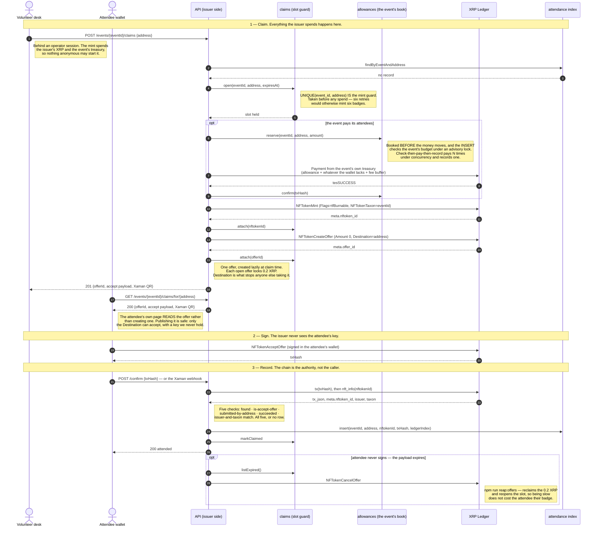
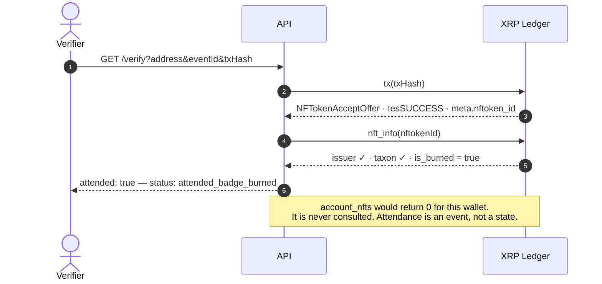
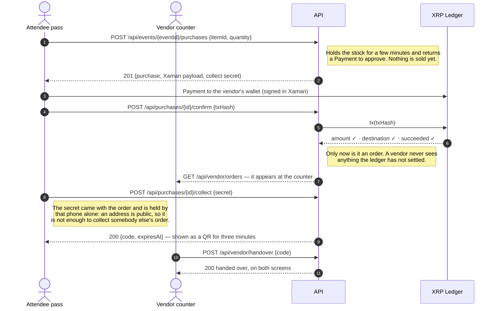

# XRPL badges

Attendance badges as soulbound NFTs on the XRP Ledger, and the money an event
hands out around them: every event has a wallet of its own, attendees are paid
an allowance when their badge is issued, and they spend it at the event's
vendors.

Badges are minted with `tfBurnable` and never `tfTransferable`, so nobody can
move one. Attendance is the accept transaction, not current ownership — a
burned badge is still attendance.

## Run it

Node 22 or newer, and Postgres.

```bash
npm install
cp .env.example .env
```

`.env` needs, at a minimum:

| | |
|---|---|
| `XRPL_ENDPOINT`, `XRPL_NETWORK` | a Clio endpoint and the network it belongs to; the server refuses to start if they disagree |
| `ISSUER_SEED`, `ISSUER_ADDRESS` | the minting account. `npm run keygen` makes one offline |
| `XUMM_API_KEY`, `XUMM_API_SECRET` | from apps.xaman.dev — wallets are proven and transactions signed through Xaman |
| `DATABASE_URL` | Postgres |
| `ADMIN_EMAIL`, `ADMIN_PASSWORD_HASH` | the desk and console login. `npm run admin:hash` prints both lines |
| `SESSION_SECRET` | signs the session cookie. `openssl rand -hex 32` |
| `TREASURY_MASTER_KEY` | seals every event wallet's seed. `openssl rand -hex 32`. Without it no event can pay anyone; lose it and the XRP in those wallets is gone |
| `BADGE_BASE_URL` | goes inside every badge's URI, which is immutable. Use a domain you will keep |

Then:

```bash
npm run migrate
npm run dev
```

http://localhost:3000 — `PORT` moves it.

For a click-through on testnet with an issuer it remembers between runs:

```bash
npm run demo
```

## The pages

| | |
|---|---|
| `/` and `/events` | every event, public |
| `/events/:eventId` | one event, its badges read off the ledger |
| `/register/:eventId` | an attendee proves a wallet and signs up |
| `/attend/:eventId` | the attendee's pass: their badge, their allowance, the store, their orders |
| `/volunteer` | the desk: look somebody up, issue their badge. Admin login |
| `/vendor` | the counter: paid orders, handed over by scanning. Vendor wallet login |
| `/admin` | organiser console: events, the event wallet, vendors, rosters. Admin login |

## The flow

Three phases. The issuer spends only in phase 1, never sees the attendee's key
in phase 2, and trusts only the ledger in phase 3.



### Why a burned badge still verifies

Verification replays the attendance transaction. It never asks who holds the
badge now, which is what makes a burn irrelevant.



## Buying at the event

The allowance is the attendee's own XRP once it lands: they pay the vendor
directly, and nothing is handed over until the ledger says the payment
happened.



## Commands

| | |
|---|---|
| `npm run dev` | the server, reloading |
| `npm run demo` | testnet click-through with the demo harness |
| `npm test` | the test suite; nothing in it touches the network |
| `npm run typecheck` | |
| `npm run migrate` | apply migrations; safe to re-run |
| `npm run keygen` | an issuer, offline. Prints the address, writes the seed to a 0600 file |
| `npm run admin:hash` | the operator password hash |
| `npm run e2e:testnet` | the whole flow against testnet, 33 assertions |
| `npm run e2e:burn` | burn behaviour, 13 assertions |
| `npm run check:cutover` | pre-mainnet checks against a running server |
| `npm run reap:offers` | cancel stale claim offers. Dry run unless told otherwise |

The issuer seed and `TREASURY_MASTER_KEY` live in the server's environment and
nowhere else — not in logs, not in responses, not in this repo.
