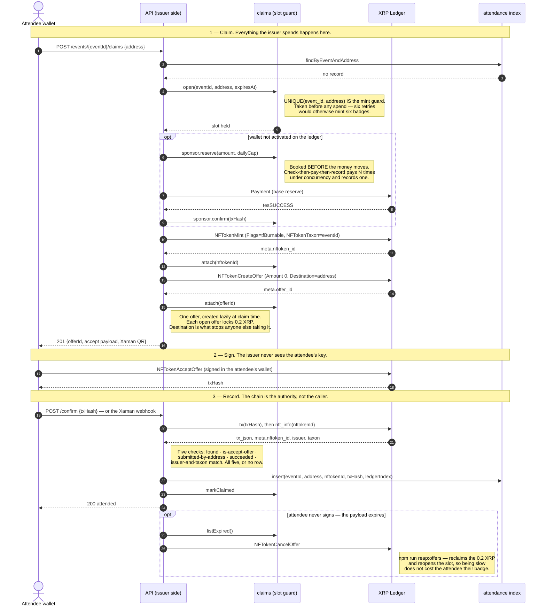
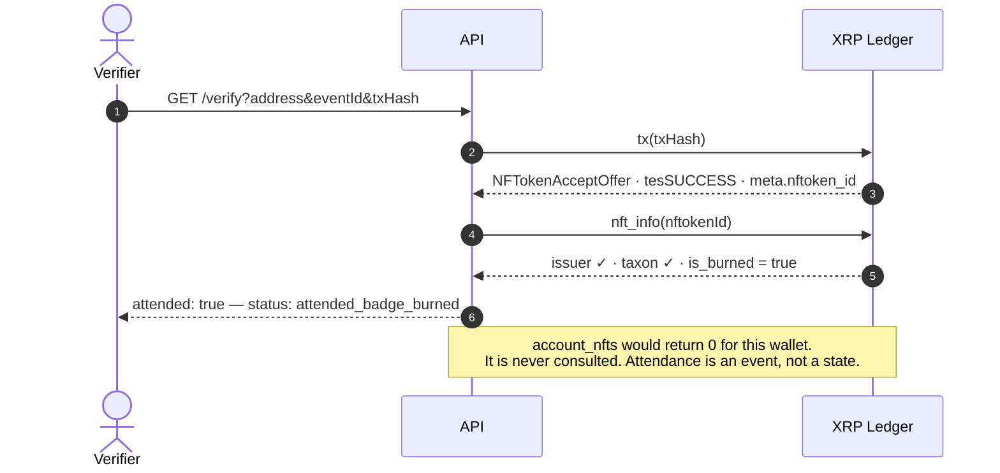

# XRPL NFT Layer

Mint, claim, and verify POAP-style attendance badges on the XRP Ledger.

Scope is deliberately narrow: **the NFT layer only**. No UI, no auth, no event
management, no payments. Spec: [`xrpl-nft-layer-brief.md`](xrpl-nft-layer-brief.md).

## There is nothing to deploy

XRPL NFTs are native protocol transaction types, not user-deployed code. There
is no Solidity, no contract address, no ABI, no gas. `NFTokenMint` is a
transaction type in the same way `Payment` is.

Going to mainnet is two changes: point `XRPL_ENDPOINT` at a mainnet node, and
use an account funded with real XRP. The transaction code is identical.

## Quick start

```bash
npm install
cp .env.example .env
npm run typecheck && npm test     # 317 tests, no network
npm run e2e:testnet               # live testnet, faucet-funded
```

`e2e:testnet` funds two throwaway wallets from the faucet and runs a full
mint → offer → accept → verify cycle. Nothing else should be attempted until
that comes back green.

| Command | What it does |
|---|---|
| `npm test` | 317 unit tests against a fake gateway. Never touches the network. |
| `npm run typecheck` | `tsc --noEmit` over `src`, `scripts`, `test` |
| `npm run build` | Emits `dist/` from `src` only, via `tsconfig.build.json` |
| `npm run e2e:testnet` | Brief §8 step 1 — the full cycle, 33 assertions |
| `npm run e2e:burn` | Brief §8 step 2 — burn a claimed badge, prove it still verifies |
| `npm run keygen` | Offline issuer keygen. Seed goes to a 0600 file, never stdout |
| `npm run migrate` | Applies `src/db/migrations/*.sql`, idempotent |
| `npm run demo` | Testnet click-through UI at `/demo`. Faucet-funds its own issuer |
| `npm run check:cutover` | Mechanises the §9 cutover checklist |
| `npm run reap:offers` | Cancels offers on abandoned claims, reclaiming 0.2 XRP each. Dry run by default |
| `npm run e2e:mainnet` | Spends real XRP. Refuses without an explicit consent flag |

## Try it — the demo harness

```bash
npm run demo
```

One command, no setup: it faucet-funds a throwaway testnet issuer, starts the
API with in-memory storage, and prints a URL. Open it and walk the seven steps
— create an attendee, claim, sign, confirm, verify, **burn**, verify again.
Step 7 is the point: `attended: true`, `status: attended_badge_burned`.

The page drives the real endpoints, not a parallel demo path. Every step shows
the method, the path, the raw JSON and an explorer link, and a request log at
the bottom lists every call it made — so you can check it is not faking
anything.

`DEMO_ENABLED` is **testnet-only by construction**: paired with mainnet it
refuses to boot rather than quietly disabling itself, and the routes re-check
the network on every request. The demo signs as the attendee because there is
no phone in the loop; production signs in Xaman and the issuer never holds an
attendee key. The page says so where you might otherwise assume wrong.

## Read this before choosing an endpoint

`nft_info`, `nft_history` and `nfts_by_issuer` are **Clio** methods. On a plain
rippled node they return `unknownCmd` — which means the verification and roster
queries silently do not exist on the endpoint the brief lists for testnet.
Measured, not assumed:

| Endpoint | Clio | NFT queries |
|---|---|---|
| `wss://clio.altnet.rippletest.net:51233` | yes | work |
| `wss://s.altnet.rippletest.net:51233` | no | `unknownCmd` |
| `wss://xrplcluster.com` (mainnet) | yes | work |

`.env.example` defaults to the Clio testnet server for that reason. Public Clio
servers carry no SLA, so `XRPL_FALLBACK_ENDPOINTS` is not decorative.

Full measurements, including exactly what survives a burn:
[`docs/ground-truth.md`](docs/ground-truth.md).

## Verified, not asserted

Every claim below was measured against live XRPL testnet, not taken from the
brief. Raw responses in `out/`, method in [`docs/ground-truth.md`](docs/ground-truth.md).

- **`e2e:testnet` — 33 assertions, 0 failed.** Soulbound flags read back out of
  the minted `NFTokenID` itself (`tfTransferable` unset, `tfBurnable` set,
  `TransferFee` 0), offer locked to the attendee, 1 offer pending during the
  claim and **0 after**, `verifyClaim` green on all five checks. Total burned:
  36 drops.
- **`e2e:burn` — 13 assertions, 0 failed.** After burning, `nft_info` still
  reports issuer and taxon, `account_nfts` reports **0**, and `verifyClaim`
  returns `attended: true` / `attended_badge_burned`.
- **The HTTP layer against the real chain.** `GET /verify` on a genuinely
  burned badge returns `attended: true`; the same wallet against a different
  event returns `not_attended` with `failedCheck: issuerAndTaxonMatch`.

## The one architectural rule

**Attendance is an event, not a state.**

Verification never asks "does this wallet hold the badge". It asks "did this
wallet ever accept a badge we issued with this taxon". The attendee's
`NFTokenAcceptOffer` transaction hash *is* the attendance record, and it stays
on the ledger forever.

A burned badge therefore yields `attended, badge burned` — not `did not attend`.
`account_nfts` returns zero for someone who demonstrably attended, which is
precisely why it must never be the test. Confirmed against a real burned token.

## The flow

Three phases. The issuer spends only in phase 1, never sees the attendee's key
in phase 2, and trusts only the ledger in phase 3.



### Why a burned badge still verifies

Verification replays the attendance transaction. It never asks who holds the
badge now, which is what makes a burn irrelevant.



## Design decisions, settled

| Decision | Consequence |
|---|---|
| Badges are **soulbound** — `tfTransferable` unset | Nobody can sell an attendance proof. Immutable after mint. |
| Badges are **issuer-burnable** — `tfBurnable` set | A badge issued in error can be revoked. |
| Mint `Flags` is exactly `1` | `tfBurnable` alone. Not `9`, not `11`. |
| `TransferFee` omitted entirely | The field is invalid without `tfTransferable` and fails the transaction. |
| `NFTokenTaxon` **is** the event id | Makes `nfts_by_issuer?taxon=N` the attendee roster. Keep ids below 2147483648. |
| Offers always set `Destination` | Without it, anyone can accept and take the badge. |
| Offers are created **lazily**, one per attendee at claim time | Each open offer locks 0.2 XRP. Pre-creating 100 locks 20 XRP at once. |

## Cost model

Fees are trivial; reserves are the real number, and they are locked, not spent.

- Base reserve **1 XRP** per account · owner reserve **0.2 XRP** per object ·
  fee ≈ **0.000015 XRP**, burned
- ~**1/12 XRP per badge** in `NFTokenPage` reserve
- **0.2 XRP per open offer** — the line that bites if offers are pre-created

100 attendees: under 0.01 XRP actually burned. A **10 XRP** issuer float is
comfortable *provided offers are lazy*. Sponsorship is different money — at 1.5
XRP each, 100 attendees is 150 XRP and it is genuinely gone. Budget it apart
from the float.

## API surface

| Method | Path | Notes |
|---|---|---|
| `GET` | `/health` | No ledger call, outside the rate limiter |
| `POST` | `/events/:eventId/claims` | Sponsors if needed, mints, creates the destination-locked offer **lazily**. Rate limited harder than anything else — it spends the issuer's XRP |
| `POST` | `/events/:eventId/claims/:offerId/confirm` | Verifies against the chain first; `422` and no write if verification fails |
| `POST` | `/webhooks/xaman` | Idempotent. Same verify-then-persist path; the body is untrusted |
| `GET` | `/events/:eventId/attendance` | The index only. Never the chain |
| `GET` | `/events/:eventId/roster` | The chain. Deliberately the expensive path |
| `GET` | `/verify` | Re-derives from the chain. `200` even when `attended:false` — that is an answer, not an error |

Errors are uniform: `{ error: { code, message, details? } }`.

## Layout

```
src/
  types.ts          shared contracts — every module implements these
  config.ts         env parsing + the mainnet/testnet guard rail
  errors.ts         typed errors; nothing in src/ throws a bare Error
  xrpl/
    client.ts       the ONLY place that opens a connection
    encoding.ts     hex URI encoding, 256-byte cap, taxon + address validation
    mint.ts         mint(), mintBatch()
    offers.ts       createClaimOffer(), cancelClaimOffer(), buildAcceptOfferPayload()
    burn.ts         burn()
    sponsor.ts      accountExists(), sponsorWallet()
    verify.ts       verifyClaim() — the five checks of brief 6.4
    roster.ts       getRoster(), getNftInfo(), getNftHistory(), getAccountNfts()
  metadata/         badge JSON + IPFS pinning
  db/               the attendance index (Postgres) + in-memory equivalents
  api/              thin Fastify surface
  xaman/            attendee-side signing payloads
scripts/            the build order of brief section 8, runnable
docs/ground-truth.md  measured ledger behaviour
```

Everything that touches the ledger takes an `XrplGateway` as its first
argument, so the whole library unit-tests offline against
`test/helpers/mock-gateway.ts`.

## The index is not the source of truth

The ledger is. The Postgres table is an index over it, and that is how every
chain application works. Read attendance from the table on a page load; expose
a separate verify endpoint that re-derives from the chain on demand.

## Where the money can leak, and what stops it

Three of these were found by an adversarial review that reproduced each one
before it was fixed. They are the parts worth understanding before you deploy.

**Sponsorship is two-phase.** `reserve()` books the spend *before* the Payment
is submitted, then `confirm()` attaches the hash, and `release()` rolls back a
Payment that never landed. Check-then-pay-then-record is a drain: measured on a
real Postgres, five concurrent claims for one address sent **five Payments and
recorded one**, leaving 6 XRP invisible to the daily cap while four callers saw
"already sponsored". Twenty concurrent against a 3 XRP cap sent 30 XRP. The
reserve path holds a `pg_advisory_xact_lock` — without it, `INSERT … WHERE
(SELECT SUM(…))` still admitted 8 reservations against a 2-reservation cap at
READ COMMITTED.

**A claim takes its slot before anything is minted.** The attendance table is
only written after the attendee signs, so it cannot guard the mint: six
unconfirmed claims once produced six badges and six open offers, locking
1.2 XRP with nothing recorded. `ClaimRepository.open()` is now the guard, and
its `UNIQUE(event_id, address)` is what makes it atomic. A failed mint releases
the slot; an abandoned one is reopened rather than locking the attendee out.

**Abandoned offers are swept.** Each open offer holds 0.2 XRP. The offer id is
persisted at claim time, and `npm run reap:offers` cancels expired ones and
reclaims the reserve. Dry run by default; `--apply` to act.

**Secrets.** `ISSUER_SEED` is server-side only — absent from the client bundle,
from error bodies, and from the log sink (pino gets an allow-list `err`
serializer, since its default emits every own property and follows `cause`).
Redaction matches whole keys, not substrings: an earlier substring rule
redacted `nftokenId` because it contains "token". `XrplConnection` refuses to
start when `ISSUER_SEED` does not derive `ISSUER_ADDRESS`. Generate the issuer
offline with `npm run keygen`; it never prints the seed.

**Rate limiting** is keyed on both client IP and claim address, so one address
cannot be hammered from many IPs. Set `TRUST_PROXY` behind an ingress or every
attendee shares one bucket. Buckets are in-process; a multi-instance deploy
needs the plugin's Redis store.

## Mainnet cutover

`npx tsx scripts/check-cutover.ts` mechanises what can be mechanised from brief
section 9 — guard assertion, node reachability and Clio support, seed present in
the environment and absent from the tree, issuer funded, offers lazy, metadata
resolving from a public gateway. The rest is `scripts/03-mainnet-rehearsal.ts`,
which spends real XRP and refuses to run without an explicit flag.
